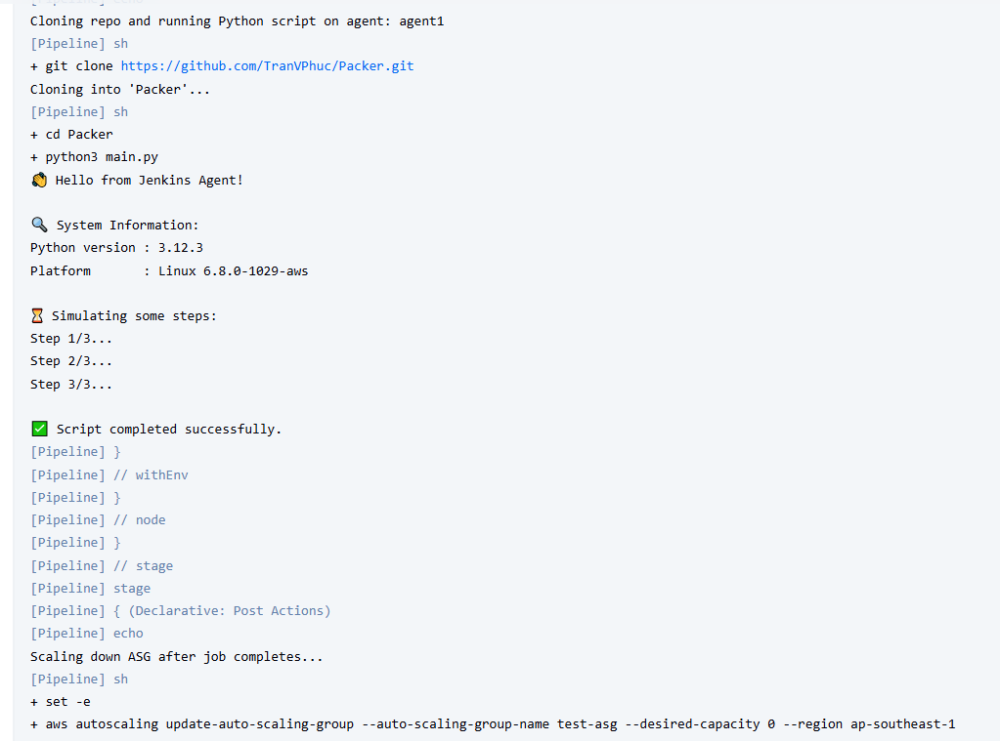

# Tạo Jenkins + Jenkins Agent AMI với Packer 

## 📦 Mục tiêu
- Tự động build Jenkins master AMI bằng Packer + Cloudinit
- Launch EC2 instance từ AMI đã có sẵn Jenkins master
- Khởi chạy, truy cập jenkins UI và thiết lập 1 agent.
- Build một Jenkins agent ami tự động kết nối đến master.
- Tạo một ASG sử dụng AMI của jenkins agent vừa được tạo. 
- Tạo một pipeline chạy một scirpt python đơn giản với điều kiện khi chạy pipeline thì ASG sẽ tự động scale 0 lên 1.

## 📁 Cấu trúc thư mục
### Jenkins master
- packer-template.pkr.hcl # Template Packer định nghĩa AMI.
- cloud-init.yaml # Cấu hình các command cài đặt jenkins cho AMI.

### Jenkins agent
- secrets.auto.pkrvars.hcl # Chứa các thông tin như jenkins url, agent token, agent name.  
- packer-template.pkr.hcl # Template Packer định nghĩa AMI.

### Jenkins pipeline
- Jenkinsfile # Cấu hình cho pipeline.

### Python Script
- main.py # Python Script.

## 🚀 Build AMI
- Sử dụng 2 command sau để tiến hành build AMI:
+ `packer init .`  
+ `packer build ami-template.pkr.hcl`

## Chạy pipeline
- Tạo một pipeline mới từ jenkins UI và tiến hành build.
- Lưu ý: Master cần có quyền thực hiện với ASG, hiện tại đang dùng IAM Role.
## Result
